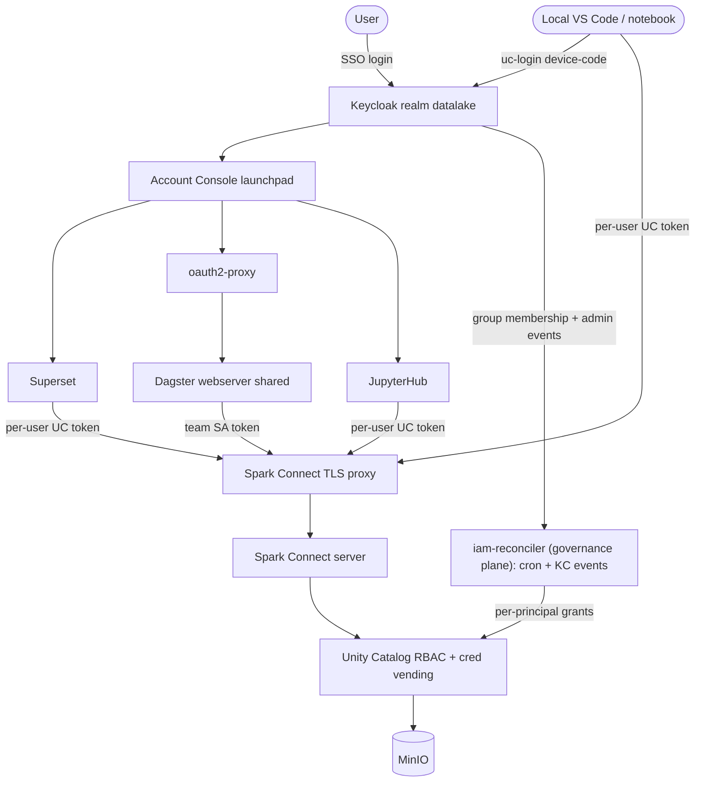

# Enterprise IAM Data Platform — Incremental Plan

Single Keycloak identity → launchpad → Superset / Dagster / JupyterHub, every query inheriting Unity Catalog RBAC. Automation runs as team service accounts; the only admin identity is UC's own `token.txt`; dbt dev is local + user-level; prod dbt runs only in Dagster as a team SA.

## Target architecture

Identity per plane:

- Superset / JupyterHub / local dev: the logged-in user (Keycloak token -> RFC 8693 exchange -> per-session UC catalog token).
- Dagster automation: the job's team service account (client-credentials -> UC token, set per session).
- Default (no token supplied anywhere): a zero-grant `nobody` principal (fail-closed) -- never admin.

## Conventions and shared pieces

- Promote the throwaway probe into a supported diagnostic `infra/iam/whoami.py` (mint token for a user/SA, show visible schemas + read attempts per layer). Used as the validation gate in every phase.
- Secret store: a thin `SecretProvider` interface with a local env/file-backed stub now, swappable to Vault / Workload Identity Federation in cloud (documented, not built locally).

---

## Phase 0 — Baseline snapshot + validation harness

- Add `infra/iam/whoami.py` (supported version of the probe used earlier).
- Record current per-persona access (analyst, engineer, demo-removed) as the golden baseline.
- Validation gate: `whoami.py analyst` -> only gold; `whoami.py engineer` -> bronze/silver/gold; reconciler `show` matches Keycloak membership.

## Phase 1 — Automation runs as a team service account (remove admin reliance)

Prerequisite for Phase 2. Files: [dagster/data_platform/ingestion.py](dagster/data_platform/ingestion.py), [dagster/data_platform/definitions.py](dagster/data_platform/definitions.py), [dbt/profiles.yml](dbt/profiles.yml), [infra/iam/provision_service_account.py](infra/iam/provision_service_account.py), [docker-compose.yml](docker-compose.yml).

- Provision a platform automation SA (`sa-platform-automation`, `data-engineer` persona) via `provision_service_account.py`; store its secret in the local `SecretProvider` stub.
- Add a Dagster `uc_identity` resource: client-credentials grant at Keycloak -> UC token; used to (a) set `spark.sql.catalog.analytics.token` on the PySpark `spark_session()` in `ingestion.py`, and (b) export `DBT_UC_TOKEN` for the dbt invocation.
- `dbt/profiles.yml`: add `server_side_parameters: {"spark.sql.catalog.analytics.token": "{{ env_var('DBT_UC_TOKEN') }}"}`.
- Validation gate: `medallion_job` succeeds running as `sa-platform-automation`; a write outside its grants is denied; confirm `token.txt` admin is not used (grep logs / temporarily break admin default to prove independence).

## Phase 2 — Eliminate the admin default (no admin except admin)

Files: [infra/spark/entrypoint.sh](infra/spark/entrypoint.sh), [infra/spark/conf/spark-defaults.conf.template](infra/spark/conf/spark-defaults.conf.template), [infra/jupyter/notebooks/00_welcome.ipynb](infra/jupyter/notebooks/00_welcome.ipynb).

- Create a zero-grant `nobody` principal (own client-credentials SA, no grants; optionally only `USE CATALOG` if the UC catalog plugin needs it to initialize -- to be tested).
- Change the Spark Connect server default `UC_TOKEN` (currently admin `token.txt`) to the `nobody` token; entrypoint mints/refreshes it (refresh non-critical since nobody has no grants -> still fail-closed).
- Update the Jupyter welcome notebook: remove the admin/shared-session narrative.
- Validation gate: a Spark Connect session with only the connect token (no UC override) sees nothing; Superset/Jupyter/dbt without a per-user token are denied; Dagster still works (Phase 1 SA token); admin reachable only via `token.txt` inside UC.

## Phase 3 — Hosted JupyterHub with per-user SSO + auto UC token

Files: new `infra/jupyterhub/` (replaces single-container `jupyter`), [docker-compose.yml](docker-compose.yml), [infra/keycloak/realm-export.json](infra/keycloak/realm-export.json).

- JupyterHub + Keycloak OIDC authenticator; each user gets their own single-user server.
- Spawner/kernel startup hook: exchange the user's OIDC token for a UC token and inject it so kernels are per-user by default (no password grant, no admin fallback). Ship a startup that builds the per-user Spark session automatically.
- Validation gate: analyst login -> notebook sees only gold, bronze/silver 403; engineer login -> broader; no path to admin.

## Phase 4 — Local dev: uc-login CLI + local dbt + local notebook kit

Files: new `infra/cli/uc-login`, [dbt/profiles.yml](dbt/profiles.yml), [dbt/dbt_project.yml](dbt/dbt_project.yml), [infra/iam/personas.json](infra/iam/personas.json), new `local-dev/` notebook kit.

- `uc-login`: device-code OAuth (passwordless) -> Keycloak -> UC token; emits `DBT_UC_TOKEN`, `UC_USER`, `SPARK_REMOTE`; caches/refreshes.
- Local dbt dev target: `server_side_parameters` token + `schema: "dev_{{ env_var('UC_USER') }}"` sandbox. Add a persona/grant path so a dev can `CREATE` in their `analytics.dev_<user>` schema (reconciler or helper provisions the dev schema + grant).
- Local notebook kit: bootstrap cell using `uc-login` to build the per-user session against remote Spark Connect (runs on the laptop as the user).
- Expose Spark Connect to laptops (tunnel/ingress); note an OIDC-validating proxy as the hardening that replaces the shared connect token (documented, later).
- Validation gate: `uc-login` as engineer -> `dbt build` into `dev_engineer` succeeds; analyst cannot build (no create grant); local notebook as analyst sees only gold; prod dbt still runs only in Dagster as the team SA.

## Phase 5 — Landing page: Keycloak Account Console launchpad

Files: [infra/keycloak/realm-export.json](infra/keycloak/realm-export.json), new `infra/oauth2-proxy/`, [docker-compose.yml](docker-compose.yml).

- Register Superset, Dagster (via oauth2-proxy), JupyterHub as OIDC clients with `rootUrl`/`baseUrl` so they appear as applications in the Keycloak Account Console; enable the applications view.
- Put `oauth2-proxy` in front of the shared Dagster webserver (SSO gate; allowed-groups = staff).
- Validation gate: one login at the account console -> tiles for Superset/Dagster/Jupyter -> click each -> SSO'd in, per-user RBAC enforced, single SSO session across all.

## Phase 6 — Dagster team-scoped service accounts (phased multi-tenant)

Files: [dagster/data_platform/definitions.py](dagster/data_platform/definitions.py), [dagster/data_platform/ingestion.py](dagster/data_platform/ingestion.py), Dagster `uc_identity` resource.

- Tag jobs/assets with `team` + `service_account`; the `uc_identity` resource resolves the job's team -> that team's SA token per run.
- Self-service guardrail: a job may only bind an SA whose team matches (validated); cross-team attach rejected.
- Keep the single SSO-gated UI (oauth2-proxy from Phase 5); document the split path into per-team code locations/deployments. Note: fine-grained per-DAG UI RBAC in one shared UI is Dagster+ only.
- Validation gate: team-A job runs as A's SA (scoped), team-B job as B's SA; cross-team binding rejected; UI reachable only by authenticated staff.

## Phase 7 — Governance-plane reconciler (cron + event-based) + hardening

Rationale: the reconciler needs Keycloak Admin API (read membership) + UC admin (apply grants), so it lives in the identity/governance plane next to UC/Keycloak -- NOT in Dagster. Putting it in Dagster would give the orchestration plane admin-level Keycloak + UC access, contradicting the least-privilege / no-admin-except-admin rule. This keeps the only admin-capable automation isolated in the governance plane.

Files: new `infra/iam/Dockerfile` + `iam-reconciler` service in [docker-compose.yml](docker-compose.yml), [infra/iam/sync_group_grants.py](infra/iam/sync_group_grants.py), [infra/iam/provision_service_account.py](infra/iam/provision_service_account.py).

- New `iam-reconciler` container built on the UC image (so it has `bin/uc`), mounting `uc_conf:ro` to read the admin `token.txt` (same pattern as `uc-bootstrap`), with network access to the Keycloak admin API. Refactor `_uc()` to call local `bin/uc` in-container (drop the `docker exec` dependency; keep a docker-exec fallback for host runs) so no docker socket is needed.
- Cron trigger (safety net): a scheduled loop in the container runs `sync_group_grants.py sync` every N minutes -> convergent periodic reconcile even if events are missed.
- Event trigger (near-real-time), pick one:
  - (a) Keycloak events webhook extension (e.g. phasetwo `keycloak-events`) that POSTs `GROUP_MEMBERSHIP` admin events to a small webhook endpoint in the reconciler; or
  - (b) poll Keycloak `/admin-events` filtered to group-membership on a short interval (no Java SPI).
  Cron remains the safety net regardless of the event path.
- Persist the state file on a volume; add a run lock (prevent cron/event overlap); alert on failure.
- Add a `--verify` drift mode (reads UC grants) -- consider bumping UC `0.5.0 -> 0.5.1` for the permission GET fix that enables it.
- Security: this is the ONLY automation holding Keycloak-admin + UC-admin creds; it sits in the governance plane with no inbound except the optional webhook. Dagster never receives these creds.
- Validation gate: a membership change reflects in access within the event/cron SLA; crash/resume converges; state-loss recovers via `--verify`; confirm Dagster holds no Keycloak-admin/UC-admin creds.

## Cross-cutting

- Update `README.md` and `.env.example` for the launchpad, JupyterHub, oauth2-proxy, `uc-login`, SA secret stub, and the no-admin rule.
- Each phase is independently testable via `infra/iam/whoami.py` + the app UIs; do not proceed to the next phase until its gate passes.

## Notes / risks

- Phase 1 must land before Phase 2 or prod breaks when the admin default is removed.
- `nobody`-default catalog init behavior needs a quick test (may need `USE CATALOG` only).
- Local dev requires reachable Spark Connect + the compute-edge connect token; the OIDC-proxy replacement for that token is a documented later hardening.
- True per-DAG in-UI RBAC is not available on Dagster OSS (Dagster+ only); per-team deployments are the OSS path if needed later.
- The `iam-reconciler` is the only admin-capable automation and is deliberately isolated in the governance plane (next to UC/Keycloak), not in Dagster/user planes; event-based trigger via a Keycloak events extension is optional (cron is the robust baseline).

