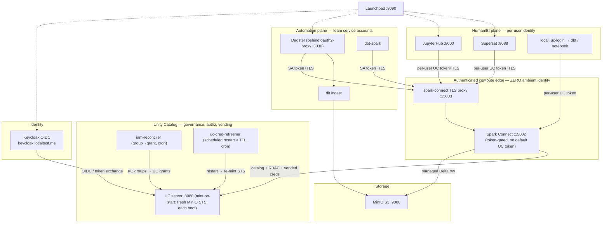

# Local, Cloud-Ready Governed Lakehouse

A self-contained, **Unity-Catalog-governed** data platform you can run with a
single `docker compose up` and lift-and-shift to any cloud by changing
configuration only. Unity Catalog sits at the top of the stack as the single
point of **governance, authentication/authorization, and secret (credential)
vending** for both **data and compute**.

| Layer | Tool |
| --- | --- |
| Storage abstraction | **MinIO** (S3-compatible; swap for S3/ADLS/GCS) |
| Governance • RBAC • secret store • credential vending | **Unity Catalog** (OSS) |
| Identity (OIDC) | **Keycloak** |
| Compute | **Apache Spark** (Spark Connect) + **Delta Lake** |
| Ingestion | **dlt** (raw → Parquet landing) |
| Transformations | **dbt** (`dbt-spark`, Spark Connect session) |
| Orchestration | **Dagster** (`dagster-dbt` + PySpark assets), behind Keycloak (oauth2-proxy) |
| Dashboards | **Apache Superset** (per-user, over Spark Connect) |
| Interactive dev | **JupyterHub** (per-user Keycloak SSO + per-user Spark Connect) |
| Local dev | **`uc-login`** CLI (run local dbt / notebooks as yourself) |
| Group→grant sync | **IAM reconciler** (governance-plane sidecar, cron + on-demand) |
| Launchpad | static landing page linking every tool |
| Metadata store | **H2 file** (UC) • **PostgreSQL** (Dagster, Superset, Keycloak) |

## Architecture



Both planes hit the **same** Spark Connect engine through the authenticated
edge; the only difference is *whose* Unity Catalog token rides the session:
automation uses a **team service-account** token, humans use their **own** token
(minted per request), so UC enforces the right RBAC for each. See
[Two planes, one engine](#two-planes-one-engine).

Data flows through a **medallion** architecture inside the `analytics` catalog,
as **UC-managed Delta tables** (UC owns the storage path and vends credentials):

```
raw CSV  --dlt-->        s3://lakehouse/staging/bronze_raw/*   (Parquet landing)
         --Dagster/Spark--> analytics.bronze.{orders,customers} (managed Delta)
         --dbt-->        analytics.silver.{stg_orders,stg_customers}
         --dbt-->        analytics.gold.customer_order_summary
         --Superset-->   dashboards (read LIVE through Spark + UC, per user)
         --Jupyter-->    ad-hoc analysis (read LIVE through Spark + UC, per user)
```

There is **no separate serving store**: the human/BI plane reads governed `gold`
**live**, per logged-in user, so Unity Catalog enforces RBAC at query time
instead of a copy losing it.

## Unity Catalog as the top of the stack

Everything that touches data or compute is mediated by Unity Catalog:

1. **Single point of authentication (data + compute).**
   - *Data plane:* clients present a token that UC validates (see
     [One-token model](#one-token-model)); UC enforces per-principal RBAC on
     catalog/schema/table operations.
   - *Compute plane:* the Spark Connect edge is **token-gated** — no anonymous
     compute (see [Compute edge auth](#compute-edge-auth)).
2. **Secret store + credential vending.** Storage keys never live in the
   engines. UC's **mint-on-start** wrapper mints a bucket-scoped MinIO **STS**
   session at every boot; UC then **vends short-lived, path-scoped credentials**
   to Spark for each managed-table path (`credScopedFs` on, auto-renewed). See
   [Credential vending](#credential-vending).
3. **Hierarchical IAM with delegated administration.** Personas, entitlements,
   and passwordless service accounts — all resolved to UC principals and grants.
   See [Hierarchical IAM](#hierarchical-iam).

### Managed tables only

All lakehouse tables are **UC-managed** Delta tables (no explicit `LOCATION`).
UC places them under `storage-root.tables` (`s3://lakehouse/managed/__unitystorage/...`),
owns the path, vends the write credentials, and — crucially — permits
`CREATE OR REPLACE`, which is exactly what dbt-spark's `table` materialization
emits. (UC forbids `REPLACE` on *external* tables.) Enabled via
`server.managed-table.enabled=true` + `storage-root.tables` in
`infra/unitycatalog/conf/server.properties`.

## Prerequisites

- Docker (Desktop or Engine + Compose plugin). On macOS/Colima, give it ~8 CPU /
  16 GB RAM.
- First start builds images and downloads Spark connector JARs (cached in the
  `ivy_cache` volume afterwards), so it can take several minutes.

## Quickstart

```bash
cp .env.example .env
docker compose up -d --build
```

Bring-up order is handled by healthchecks/`depends_on`:
MinIO → Unity Catalog (mint-on-start) → uc-bootstrap → Spark (token) →
spark-connect (TLS proxy) → Dagster / dbt / JupyterHub / Superset / iam-reconciler.

Open the **Launchpad** at http://localhost:8090 — it links to every tool with a
short explanation of the identity model. Then materialize the pipeline in
**Dagster** (http://localhost:3030 → log in via Keycloak as `engineer` →
`medallion_job` → *Materialize all*), or from the CLI:

```bash
docker exec -w /opt/dagster/app dataplatform-dagster-webserver-1 \
  dagster job execute -m data_platform.definitions -j medallion_job
```

> **Zero ambient identity.** The Spark Connect edge holds **no** default Unity
> Catalog token. A session that doesn't present its own token authenticates as
> nobody and UC denies it (fail-closed). Automation presents a **team
> service-account** token; humans present their **own** token. There is no admin
> profile to fall back to — see [Two planes, one engine](#two-planes-one-engine).

## Service endpoints & credentials

| Service | URL | Credentials |
| --- | --- | --- |
| **Launchpad** | http://localhost:8090 | none (links to everything below) |
| Dagster | http://localhost:3030 | **Keycloak SSO** via oauth2-proxy; needs `data-engineer`/`platform-admin` |
| Unity Catalog API | http://localhost:8080 | bearer token (see below) |
| Unity Catalog UI | http://localhost:3000 | Keycloak login (`--profile ui`) |
| Spark Connect (TLS proxy) | `sc://localhost:15003` | `use_ssl=true` + `SPARK_CONNECT_TOKEN` |
| Spark Connect (direct, loopback) | `sc://localhost:15002` | `SPARK_CONNECT_TOKEN` (no TLS on loopback) |
| Superset | http://localhost:8088 | `admin` / `admin` (SSO: Keycloak users) |
| JupyterHub | http://localhost:8000 | **Keycloak SSO** (e.g. `analyst`/`analyst`, `engineer`/`engineer`) |
| MinIO console | http://localhost:9001 | `minioadmin` / `minioadmin` |
| Keycloak admin | https://keycloak.localtest.me/admin | `admin` / `admin` (master realm) |
| Postgres | `localhost:5432` | `platform` / `platform` |

All defaults live in `.env` and are for **local use only** — rotate everything
for any real deployment.

## Compute edge auth

The Spark Connect server **requires a pre-shared bearer token on every RPC**
(`spark.connect.authenticate.token`, native `PreSharedKeyAuthenticationInterceptor`).
Anonymous or wrong-token clients are rejected.

OSS Spark Connect has **no native TLS**, and PySpark only allows token auth to a
**non-localhost** host over TLS. So cross-container clients (Dagster, dbt,
Jupyter) go through a **TLS-terminating gRPC proxy** (`spark-connect:15003`,
nginx) that forwards to `spark:15002`; the token is validated at the server
(defense in depth). Clients trust the proxy's self-signed cert via
`GRPC_DEFAULT_SSL_ROOTS_FILE_PATH` (shared `connect_tls` volume):

```
SPARK_REMOTE = sc://spark-connect:15003/;use_ssl=true;token=$SPARK_CONNECT_TOKEN
GRPC_DEFAULT_SSL_ROOTS_FILE_PATH = /certs/server.crt
```

Host-local dev can skip TLS over loopback: `sc://localhost:15002/;token=<token>`.

### One-token model

Like Databricks' single-token experience, a caller holds **one token** that
governs both compute and data:

- **Automated identities (Dagster, dbt, provisioned SAs):** a passwordless
  Keycloak **client-credentials** token, exchanged at UC (RFC 8693) for a
  UC access token; UC then applies the principal's RBAC. The same secret is the
  Spark Connect edge token for compute.
- **Per-user OIDC (production upgrade, documented):** put JWT validation at the
  same `spark-connect` proxy. Two supported shapes:
  1. **nginx `auth_request`** to a small sidecar that validates the incoming
     `Authorization: Bearer` JWT against Keycloak's **JWKS**
     (`/realms/datalake/protocol/openid-connect/certs`) and maps `sub`/`email`
     to a UC principal before `grpc_pass`; or
  2. swap nginx for **Envoy** with the `jwt_authn` filter (remote JWKS, issuer
     `http://keycloak:8080/realms/datalake`, audience `unitycatalog`).
  The pre-shared token stays as the service-to-service floor; per-user JWTs ride
  on top so UC sees the real end user. (Implemented here as the pre-shared edge
  + this documented JWKS path.)

## Credential vending

Storage secrets live only in Unity Catalog:

1. **Mint-on-start.** UC's own entrypoint (`infra/unitycatalog/uc-entrypoint.sh`,
   `aws-cli` baked into the image) calls MinIO's **STS `AssumeRole`** to mint a
   **bucket-scoped, temporary** session and injects
   `accessKey/secretKey/sessionToken` into `server.properties` (`s3.*.0`) — as
   the **first step of every (re)start**. UC reads storage creds only at boot
   (no hot-reload), so minting here guarantees UC never comes up with an
   **expired** session; a crash-triggered `restart` is self-healing. To rotate
   on demand, just restart UC: `docker compose restart unitycatalog`.
   - **Scheduled fail-safe refresh (`uc-cred-refresher`).** UC vends the boot
     session unchanged for its whole life (no hot-reload; no working runtime
     reload API; a permanent key is refused for vending), so the only supported
     refresh is a restart — and every restart re-mints a full-TTL session. An
     admin-plane sidecar (`infra/unitycatalog/refresh/uc-cred-refresher.sh`)
     restarts UC on a schedule **comfortably inside the STS TTL**
     (`UC_REFRESH_INTERVAL_SECONDS`, default 6 days vs the 7-day TTL) so the
     vended session is always young and never expires under a running workload.
     It holds the Docker socket **only** to issue that restart — keep it
     admin-only (single purpose, no ports); for prod front it with a
     docker-socket-proxy limited to `POST /containers/*/restart`.
2. Unity Catalog **vends** those (already down-scoped) credentials to engines,
   path-scoped per table, on demand.
3. Spark consumes them automatically for managed-table paths
   (`spark.sql.catalog.analytics.credScopedFs.enabled=true`,
   `renewCredential.enabled=true`) — no static keys in the engine for governed data.

In cloud this maps 1:1 to native STS/Workload Identity (see
[Going multi-cloud](#going-multi-cloud)); the mint-on-start step exists only because MinIO's
STS isn't wired into UC's cloud providers.

## Hierarchical IAM

A two-plane model with **delegated administration**, defined in `infra/iam/`:

- **Identity plane (Keycloak):** realm roles gate *who may do what*. The
  `sa-creator` role is the **delegated-admin entitlement** for provisioning
  service accounts; persona roles (`platform-admin`, `data-engineer`, `analyst`)
  tag humans; and `team-<name>` roles (e.g. `team-analytics`), inherited via a
  `team-<name>` group, scope *which team's Dagster pipelines* a person may launch.
  Seed users: `engineer` (data-engineer, in `team-analytics`), `engineer2`
  (data-engineer, no team — for testing the launch guard), `platformadmin`
  (platform-admin), `analyst` (read-only gold).
- **Authorization plane (Unity Catalog):** the source of truth for data access;
  every principal gets explicit UC grants.
- **Personas** (`infra/iam/personas.json`) are named grant templates —
  `platform-admin`, `data-engineer`, `ingestion-bot`, `analyst` — each with a
  `max_scope` and a `can_create_service_accounts` flag.

**Passwordless service accounts** are provisioned by
`infra/iam/provision_service_account.py`, which:

1. checks the **requester** holds the `sa-creator` entitlement (else deny),
2. creates a Keycloak **client-credentials** client (audience + email mappers so
   UC can validate and map it),
3. registers the UC principal and applies the persona's grants, and
4. appends every decision (allow/deny) to `infra/iam/audit.log`.

```bash
# entitled requester provisions a bronze-only ingestion SA (allowed)
python3 infra/iam/provision_service_account.py \
  --requester-user engineer --requester-password engineer \
  --name orders-ingest --persona ingestion-bot

# unentitled requester is rejected and audited
python3 infra/iam/provision_service_account.py \
  --requester-user analyst --requester-password analyst \
  --name evil-bot --persona ingestion-bot
```

Seed humans (via `uc-bootstrap` + Keycloak realm `datalake`):

| User | Password | Persona / grants |
| --- | --- | --- |
| `engineer` | `engineer` | `data-engineer` + `sa-creator`: build across bronze/silver/gold; may provision SAs |
| `analyst` | `analyst` | `analyst`: `SELECT` on **gold** only |

## Querying the results

Any Spark Connect client works — through the authenticated edge. From the
bundled Jupyter/Dagster images (env already wired):

```python
import os
from pyspark.sql import SparkSession
spark = SparkSession.builder.remote(os.environ["SPARK_REMOTE"]).getOrCreate()
spark.sql("SELECT * FROM analytics.gold.customer_order_summary "
          "ORDER BY total_amount DESC").show()
```

dbt on its own (inside the Dagster image, session method over Spark Connect):

```bash
docker exec -w /opt/dagster/app/dbt dataplatform-dagster-webserver-1 \
  dbt build --profiles-dir /opt/dagster/app/dbt
```

## Two planes, one engine

The platform has exactly **two ways in**, and both run on the *same* Spark
Connect engine — the difference is only *whose* Unity Catalog token is on the
session:

- **Automation plane** — Dagster, dbt, provisioned service accounts. Uses a
  passwordless **team service-account** token (Keycloak client-credentials →
  UC), and writes/reads the medallion tables. This is what builds `gold`.
  A Dagster job tagged `team: <name>` runs as **that team's** SA
  (`sa-team-<name>`, auto-provisioned by the IAM reconciler from
  `personas.yaml`), so a team attaches its own least-privilege identity to its
  own DAGs. Untagged jobs use the **least-privilege default SA** (catalog-only,
  no data) — so real work must be team-tagged.
- **Human/BI plane** — Superset dashboards and Jupyter analysis. Each request
  carries the **logged-in user's own** UC token, so UC enforces *their* grants.
  An `analyst` sees only `gold`; `bronze`/`silver` return `403`.

The reason there's no ClickHouse/Trino serving copy: the moment governed data is
read *outside* UC, its RBAC is lost. Keeping every read on Spark-through-UC means
**the same grants apply everywhere**, live, with no replication.

### Superset: per-user UC RBAC over Spark Connect

Superset logs users in via **Keycloak SSO**, then connects to the bundled
**“Spark Connect (Unity Catalog)”** database. That database is our small
`spark_connect_uc` connector (`infra/superset/spark_connect_uc/`): a SQLAlchemy
dialect + DBAPI + Superset engine-spec that, per query,

1. takes the user's Keycloak access token (SIP-85 OAuth2, `impersonate_user`),
2. exchanges it for a UC token (RFC 8693), and
3. opens an **isolated** Spark Connect session with
   `spark.sql.catalog.analytics.token` set to *that* user's token.

So a chart built by `analyst` can only touch `gold`; querying `bronze` returns a
UC `403`, and a missing/expired token trips Superset's OAuth2 re-auth
(fail-closed — never a shared fallback). All released software, no core forks.

### JupyterHub: per-user SSO + identity

JupyterHub (http://localhost:8000) logs each user in via **Keycloak SSO** and
spawns a per-user notebook server. The spawner injects the user's Keycloak token;
`00_welcome.ipynb` calls `uc_notebook.uc_session()`, which exchanges it for a UC
token and binds it to a fresh Spark Connect session — so UC enforces *your* RBAC
(an `analyst` sees only `gold`). Same mechanism as Superset; no admin default.

**Parallel users are isolated and their work persists.** Each user gets their own
notebook process/kernels, their own per-user UC token (so data access is isolated
by UC RBAC), and their own **persisted workspace** at `notebooks/<username>/`
(seeded with the starter notebook on first login, never re-clobbered on return).
The workspace root is a host bind-mount, so files survive logout, idle-cull, and
container restarts. Locally this runs on `SimpleLocalProcessSpawner`; in cloud,
`KubeSpawner`/`DockerSpawner` give the same isolation via a per-user volume.

### Dagster: Keycloak SSO + persona-based access

Dagster OSS has no built-in auth, so it runs **behind `oauth2-proxy`**
(the `dagster-auth` service publishes `:3030`). Only members whose persona
carries the `data-engineer` or `platform-admin` realm role (surfaced as a
`groups` claim) may open the orchestration UI; an `analyst` is denied `403`.
Access is thus **inherited from the persona**, consistent with data RBAC.

### Dagster: team-scoped *launch* authorization (fail-closed)

Getting into the UI is coarse — anyone past the turnstile can *see* every job.
The real per-team boundary is enforced **at launch + execution**:

- A custom webserver entrypoint (`dagster/serve.py`) wraps stock
  `dagster-webserver` with an ASGI middleware that stamps every UI-launched run
  with the caller's **verified** identity (`launched_by` / `launched_by_groups`),
  read from the `oauth2-proxy` `X-Auth-Request-*` headers. Any browser-supplied
  identity tags are stripped first, so the launcher cannot be forged.
- The execution-path guard `data_platform.uc_identity.authorize_team_run` then
  **fails closed**: to launch a job tagged `team: <name>` the launcher must hold
  the `team-<name>` realm role; `platform-admin` may launch any team; backend
  launches (schedule / daemon / CLI, which never cross the authenticated UI
  edge) carry no launcher and are trusted platform automation.

So `engineer` (has `team-analytics`) can run `analytics_team_job`, but
`engineer2` (a `data-engineer` without it) is refused before any Spark/dbt work —
and even so, the run's blast radius is still bounded by its team SA's UC grants.
Run `python -m data_platform.authz_selftest` in the Dagster container to see the
allow/deny matrix.

### Local developer kit: run dbt / notebooks as yourself

No admin profile lives on any laptop. Authenticate as yourself, then work
locally — Unity Catalog enforces your grants exactly as in-cluster:

```bash
python3 -m venv .venv && source .venv/bin/activate
pip install -r dev/requirements-local.txt
eval "$(bin/uc-login)"            # Keycloak device flow (or --password for local)
cd dbt && dbt build               # runs as YOU (engineer builds; analyst is denied)
# local notebook: `import uc_notebook; uc_notebook.uc_session()`
```

`bin/uc-login` gets a Keycloak token (passwordless device flow), exchanges it for
a UC token, caches it in `~/.uc/`, and prints the `export`s local dbt + notebooks
need (`DBT_UC_TOKEN`, `SPARK_REMOTE`, …). In **production** the same code path is
used only for user-scoped local dev; **team pipelines run in Dagster** under the
team service account — a user can never assume the admin identity.

### IAM reconciler: Keycloak groups → Unity Catalog grants

UC OSS has no native group principal, so the **`iam-reconciler`** governance-plane
sidecar (co-located with UC, the *only* automation holding the UC admin token)
reconciles Keycloak **group membership** into explicit per-principal UC grants on
a cron interval, and on demand for event triggers:

```bash
# lifecycle: join a group -> get the persona's grants; leave -> they're revoked
docker exec dataplatform-iam-reconciler-1 python3 /iam/sync_group_grants.py add-member    --user alice --group data-engineers
docker exec dataplatform-iam-reconciler-1 python3 /iam/sync_group_grants.py reconcile
docker exec dataplatform-iam-reconciler-1 python3 /iam/sync_group_grants.py remove-member --user alice --group data-engineers
```

Membership also confers Keycloak realm roles (Superset feature access, Dagster
UI access, the `sa-creator` entitlement) off the same source of truth. Verify any
principal's effective access with `infra/iam/whoami.py`
(`python /tmp/whoami.py user analyst analyst`).

**Teams are provisioned the same way.** Declaring a team under `teams` in
`infra/iam/personas.json` makes the reconciler (`ensure-teams`, part of every
`sync`) create the `team-<name>` **launch role** and a `team-<name>` Keycloak
group carrying it — no manual Keycloak clicks. People join a team by group
membership (`add-member --group team-<name>`), inheriting the launch role that
`data_platform.uc_identity.authorize_team_run` checks. So a team's three facets
come from one declarative source: **who may launch** its DAGs (`team-<name>`
role), **what its automation may touch** (its service account's UC grants), and
**what its people may touch** (persona grants).

**Role inheritance (admin above all teams).** `umbrella_admin_role` in
`personas.json` (default `platform-admin`) is a Keycloak **composite role** that
automatically **includes every `team-<name>` role**. Whoever holds it therefore
sits above all teams — able to launch any team's pipelines — with no per-team
assignment, and **new teams roll up into it automatically** the moment the
reconciler provisions them. The same composite mechanism nests further if you
later want within-team tiers (e.g. `analytics-admin ⊃ analytics-engineer ⊃
analytics-analyst`). Set `umbrella_admin_role` to `null` to disable.

Inheritance covers **two layers**, and they work differently:

- **App layer** (Dagster launch, Superset features) — inheritance is *native*:
  the composite role puts the inherited badges straight into the token.
- **Data layer** (Unity Catalog) — UC OSS is **flat and per-principal**; it
  reads no roles/groups/composites at query time. So the reconciler **flattens
  the hierarchy into explicit per-principal grants**: a team may declare a
  default data scope (`teams.<name>.grants`), team-group members inherit it, and
  the umbrella admin inherits the **union of every team's data grants**. This is
  the same "compile the hierarchy down to explicit grants" trick used for group
  emulation — revocation still works because the desired set is recomputed each
  pass. (Verified: `platformadmin`, whose persona grants no table access, can
  read `gold` purely by inheriting the analytics team's scope, while `bronze`/
  `silver` stay `403`.)

## Going multi-cloud

`.env` + `server.properties` are the switch surface. The dbt models, Dagster
assets, personas, and catalog layout do **not** change — only storage
endpoint/credentials, the Spark hadoop connector, and the IdP.

| Concern | Local | Cloud change |
| --- | --- | --- |
| Object store | MinIO (`s3://lakehouse`) | Real bucket + `s3.*` block; drop the mint-on-start wrapper |
| Credential vending | MinIO STS via UC mint-on-start | Native STS `AssumeRole` (`aws.masterRoleArn`) / ADLS SAS / GCS |
| Storage connector | `hadoop-aws` (S3A) | `hadoop-azure` + `abfss://` / `gcs-connector` + `gs://` |
| Identity | Keycloak | Okta / Entra ID / Google — point `server.authorization-url`, `token-url`, `client-id/secret`, `allowed-issuers`, `audiences` at it |
| UC metadata store | H2 file (persisted) | PostgreSQL (see below) |
| Compute edge auth | pre-shared token + TLS proxy | add per-user OIDC/JWKS at the proxy (Envoy `jwt_authn`) |

### UC metadata: H2 now, Postgres later

UC metadata uses **H2 in file mode** on the `uc_data` volume (persists across
restarts). Postgres is wired and preferred for production, but UC `0.5.x` has two
open bugs that break **managed** Delta tables on Postgres —
[#1364](https://github.com/unitycatalog/unitycatalog/issues/1364) (`BINARY(16)`
DDL for `uc_delta_commits`) and
[#1385](https://github.com/unitycatalog/unitycatalog/issues/1385) (`DELETE … LIMIT`;
fix [PR #1446](https://github.com/unitycatalog/unitycatalog/pull/1446) merged
*after* 0.5.1). H2 handles both. Switch to the Postgres block in
`infra/unitycatalog/conf/hibernate.properties` once UC ships those fixes.

### Durability — nothing is lost on crash *or* recreate

All stateful components persist on named volumes or host bind-mounts, so a crash,
`docker restart`, or host reboot loses nothing:

| State | Where it lives | Survives crash | Survives `down`/recreate |
| --- | --- | --- | --- |
| Data (Delta tables) | `minio_data` | ✅ | ✅ |
| UC metadata + **grants** | `uc_conf` + `uc_data` (H2 file) | ✅ | ✅ |
| Dagster runs • Superset • **Keycloak** (users/roles/groups/**membership**) | `postgres_data` | ✅ | ✅ |
| Reconciler state ledger + `audit.log` | `./infra/iam` bind-mount | ✅ | ✅ |
| Per-user notebooks | `./infra/jupyter/notebooks` bind-mount | ✅ | ✅ |

Keycloak is **Postgres-backed** (`KC_DB=postgres` → the shared `keycloak` DB), so
its identity state — including runtime `add-member` changes and provisioned
service accounts — survives container recreate and image upgrades, not just
crashes. `--import-realm` seeds `realm-export.json` only into an *empty* DB
(`IGNORE_EXISTING`) and then leaves the persisted realm alone; to re-seed after
editing the realm file, drop the `keycloak` database (or the realm) first. A full
`docker compose down --volumes` is the only thing that wipes state (by design).

## Version notes

Pinned in `.env`. The Unity Catalog Spark connector `0.5.0` publishes stable
Maven artifacts only for **Spark 4.0.x / 4.1.x** (4.2 exists only as CI
snapshots), so we pin **Spark 4.1.0 + Delta 4.3.0 + unitycatalog-spark 0.5.0**.
The Spark Connect Python client version **must equal** the server version.

Superset (4.1.1) ships the `spark_connect_uc` connector on `pyspark[connect]`
pinned to the **same** server version. It runs with pandas 2.3 / pyarrow 25
(above Superset's declared caps but verified working) because
`pyspark[connect]` floors those higher; only `cryptography` is pinned `<43` to
keep pyOpenSSL/TLS working.

## Repository layout

```
docker-compose.yml              # all services
.env.example                    # versions + storage/IdP/token config (the switch surface)
data/                           # sample raw CSVs (orders, customers)
infra/
  postgres/init/                # Dagster + Superset databases
  minio/init/                   # bucket + sample data
  keycloak/realm-export.json    # OIDC realm, clients, roles, seed users
  unitycatalog/
    conf/                       # server.properties (authz, vending, managed root) + hibernate (H2/PG)
    Dockerfile                  # UC image + aws-cli/su-exec for mint-on-start
    uc-entrypoint.sh            # mint-on-start: fresh MinIO STS each boot -> UC creds, then exec server
    bootstrap/                  # catalog/schema/user/RBAC bootstrap
    ui/Dockerfile               # optional UI (profile: ui)
  iam/                          # hierarchical IAM: personas.json, provision_service_account.py,
                                #   sync_group_grants.py (reconciler) + Dockerfile, whoami.py, audit.log
  spark/                        # Spark Connect image (Delta + UC + S3A + edge token, zero ambient id)
  spark-connect-proxy/          # nginx TLS gRPC proxy + self-signed cert generator
  dagster/                      # Dagster image (dagster-dbt + Spark Connect client)
  jupyter/                      # JupyterHub image + config + notebooks (per-user Keycloak SSO)
  superset/                     # Superset image + spark_connect_uc connector (per-user UC RBAC)
  landing/                      # static launchpad page (nginx)
bin/uc-login                    # local dev: Keycloak login -> UC token -> env exports
dev/requirements-local.txt      # pinned deps for local dbt / notebooks
dbt/                            # dbt-spark project (managed Delta: staging -> marts)
dagster/data_platform/          # Dagster code location (dlt, bronze, dbt assets, team SAs)
```

## Troubleshooting

- **Spark not healthy yet.** It resolves connector JARs on first boot; healthy
  once `:15002` binds. Cached in `ivy_cache`.
- **Spark Connect client rejected / hangs.** The edge requires the token. Use
  `sc://spark-connect:15003/;use_ssl=true;token=$SPARK_CONNECT_TOKEN` with
  `GRPC_DEFAULT_SSL_ROOTS_FILE_PATH=/certs/server.crt` (cross-container), or
  `sc://localhost:15002/;token=…` on the host.
- **Dagster shows no assets / import error.** Asset modules must **not** use
  `from __future__ import annotations` (PEP 563 stringifies the
  `context: AssetExecutionContext` hint, which Dagster 1.11 rejects).
- **OIDC single deterministic issuer.** With `KC_HOSTNAME` set, Keycloak stamps
  ONE issuer for every token: `https://keycloak.localtest.me` (the Caddy gateway).
  In-cluster callers reach that issuer via a docker network **alias**
  (`keycloak.localtest.me -> caddy`), so UC/MinIO fetch JWKS over TLS from the same
  issuer listed in `server.allowed-issuers`; backchannel token/userinfo calls use
  `keycloak:8080`. (This replaced the old `localhost:8087` split-horizon +
  `uc-kc-jwks-bridge` sidecar, which were removed in Phase 3.) JupyterHub/Superset
  read claims from the `id_token`
  to avoid the userinfo round-trip.
- **Dagster / Superset SSO login denied (`403` / invalid login).** Access is
  persona-gated: the user needs the right realm role/group. Add them with the
  reconciler's `add-member`, then `reconcile`.
- **Reset everything:** `docker compose down --volumes --remove-orphans`.

## Deferred (later phases)

By design, not in this build: lineage/observability (OpenLineage/Marquez),
CI/CD for the platform itself, and cloud IaC (Helm/Terraform).
